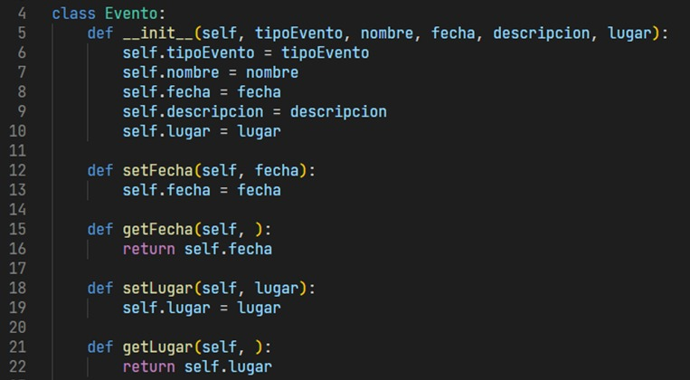
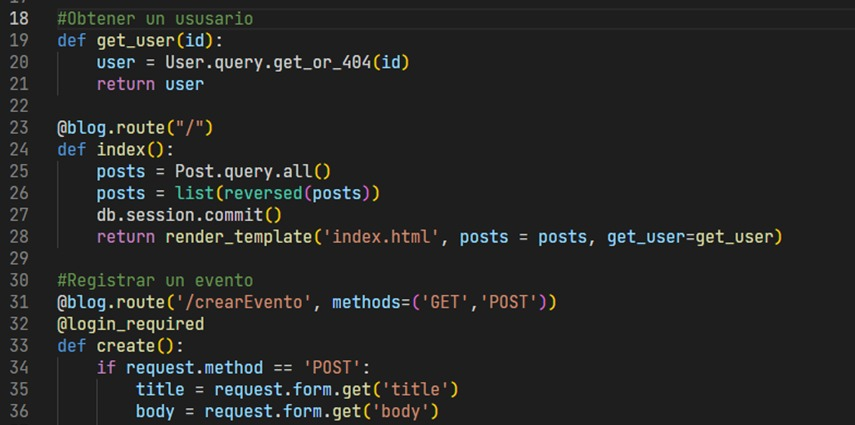

# ProyectoFinal-lS

# Estilos de Programación
1. 

2. 

3. 

# Codificación legible
1. Comentarios y documentación

2. Sangría consistente

3. Agrupación de código 

4. Organización de archivos y carpetas
< img src="imagenes/estilo5.jpeg" width="100" height="50">

# Principios SOLID
1. 

2. 

3. 
