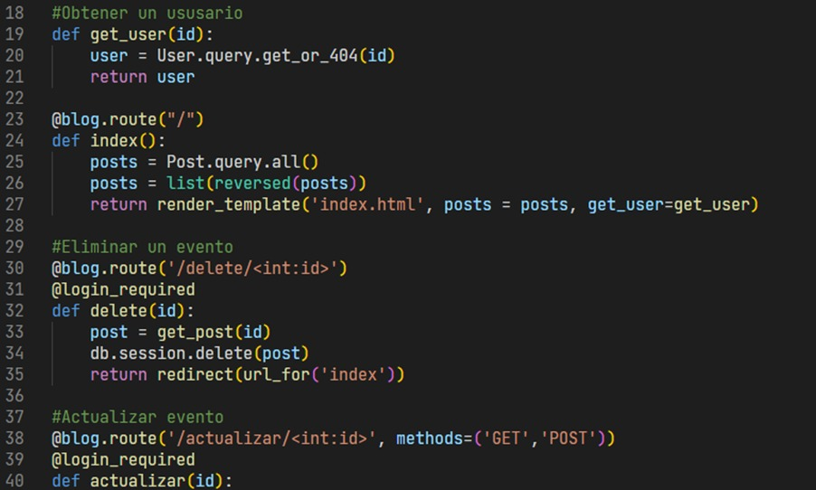
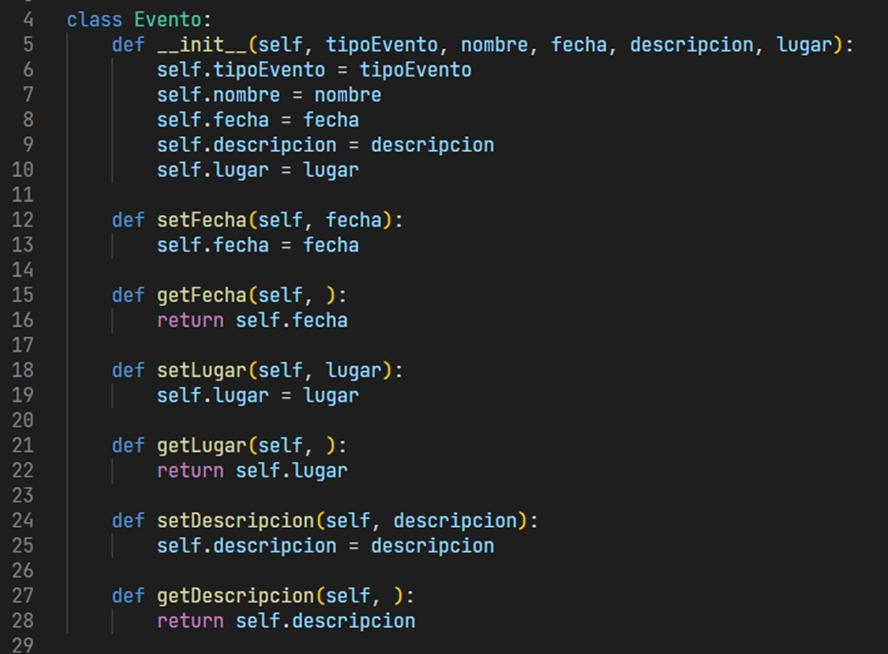
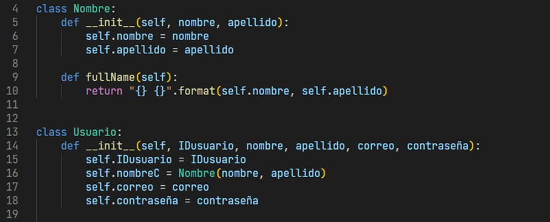
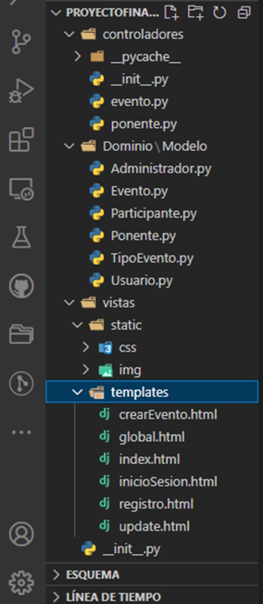

# ProyectoFinal-Ingeniería de Software

# Estilos de Programación
## 1. Code Golf
Este estilo se refiere a intentar resolver un problema utilizando la menor cantidad de caracteres posibles.

## 2. Things
El estilo 'Things' tiene sentido para el dominio del problema.
Lo usamos en la carpeta Modelos/Evento.y

## 3. Pipeline
Es un estilo de programación orientado a objetos ...

# Codificación legible
## 1. Comentarios y documentación

En esta fracción del codigo se observa que cumple con la documentación sin necesidad de hacer comentarios redundantes.

## 2. Sangría consistente
La sangría se usa de forma adecuada permitiendo la visualización de un código ordenado y fácil de leer.

## 3. Agrupación de código 
En fracciones de código se ve un comentario
En cada porción de código que se va analizando se observa mediante un comentario el comportamiento que tiene dicha porción.

## 4. Organización de archivos y carpetas
Es recomendable dividir carpetas y archivos para una mejor distribución del proyecto.
  

## 5. Evite la anidación profunda
Se debe de evitar la anidación profunda, ya se si no se cumpla con esta práctica el código sería menos entendible.

# Principios SOLID
## 1. Open/Closed

## 2. Single Responsability
Una clase debe tener una sola responsabilidad. Este principio se ocupa específicamente de la cohesión. La cohesión se define como la afinidad funcional de los elementos de un módulo.

## 3. 

